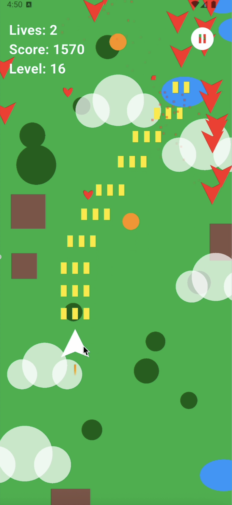

# ✈️ Flying Fighter

<div align="center">


 

**A classic arcade-style flying fighter game built with Flutter & Flame Engine**

[](https://flutter.dev)
[](https://flame-engine.org)
[](LICENSE)

[Features](#-features) • [Gameplay](#-gameplay) • [Installation](#-installation) • [Controls](#-controls) • [License](#-license)

</div>

---

## 📖 About

**Flying Fighter** is an educational arcade-style shooter game developed with Flutter and the Flame game engine. Control your fighter plane, dodge incoming enemies and bullets, collect power-ups, and survive as long as possible while climbing through progressively challenging levels.

> **⚠️ Educational Purpose Only**  
> This game is developed strictly for educational and learning purposes. It cannot be commercialized or published to any app store (Google Play, App Store, AppGallery, etc.). See [LICENSE](LICENSE) for full details.

---

## ✨ Features

<video src="assets/game_play.mp4" width="600" controls></video>

### 🎮 Core Gameplay
- **Touch Controls**: Smooth drag-and-pan controls to navigate your fighter plane
- **Progressive Difficulty**: Dynamic level system that increases challenge as you advance
- **Lives System**: Start with 3 lives, collect hearts to gain more (max 10 lives)
- **Score Tracking**: Earn points by destroying enemies and advance through levels

### 🚀 Power-Ups
- **⚡ Rapid Fire** (Level 1+): Increases your firing rate for devastating attacks
- **🔫 Multi-Shot** (Level 1+): Fire multiple bullets simultaneously
- **🛡️ Shield** (Level 10+): Temporary invincibility protection
- **❤️ Heart** (Level 10+): Restore one life

### 💥 Enemy Mechanics
- **Wave Spawning**: Enemies spawn in increasing numbers per wave
- **Shooting Enemies**: At level 10+, enemies start firing back at you
- **Escalating Spawn Speed**: Enemy waves spawn faster as you level up

### 🎯 Progressive Difficulty System
- **Level 1-4**: Basic enemy spawning, power-up introduction
- **Level 5-9**: Power-ups become more common, more enemies per wave
- **Level 10+**: Enemies shoot back, all power-ups available, maximum challenge
- **Dynamic Speed**: Spawn interval decreases from 1.5s to minimum 0.3s

### 🎨 Visual & UI
- **Animated Background**: Scrolling background with clouds and obstacles
- **Particle Effects**: Explosions and visual feedback
- **HUD Display**: Real-time lives, score, and level tracking
- **Pause & Resume**: Pause menu with resume and restart options
- **Game Over Screen**: Final stats and quick restart

---

## 🎮 Gameplay

### Objective
Survive enemy waves, destroy aircraft, collect power-ups, and achieve the highest score possible!

### How to Play
1. **Launch the game** and your fighter plane appears at the bottom
2. **Drag your finger** anywhere on the screen to move your plane
3. **Automatic firing** - your plane shoots automatically
4. **Dodge enemies** and their bullets (level 10+)
5. **Collect power-ups** for temporary boosts
6. **Survive** - don't let enemies hit you or your lives decrease
7. **Level up** every 100 points × current level

### Scoring System
- **+10 points** per enemy destroyed
- **Level up** at: 100, 200, 300, 400... points
- Each level increases difficulty and unlocks new mechanics

---


### Supported Platforms
- ✅ Android
- ✅ iOS
- ✅ Web
- ✅ Windows
- ✅ macOS
- ✅ Linux

---

## 🎯 Controls

### Mobile & Tablet
- **Touch & Drag**: Move your finger anywhere on the screen to control the plane
- **Tap Pause Button**: Access pause menu

### Desktop & Web
- **Mouse Drag**: Click and drag to move the plane
- **Click Pause Button**: Access pause menu

---

## 🏗 Project Structure

```
lib/
├── main.dart                          # App entry point
└── game/
    ├── plane_game.dart                # Main game logic
    ├── components/
    │   ├── player.dart                # Player fighter plane
    │   ├── enemy.dart                 # Enemy aircraft
    │   ├── enemy_bullet.dart          # Enemy projectiles
    │   ├── bullet.dart                # Player bullets
    │   ├── power_up.dart              # Collectible power-ups
    │   ├── particle.dart              # Particle effects
    │   └── background.dart            # Scrolling background
    └── overlays/
        ├── hud.dart                   # HUD (lives, score, level)
        ├── pause_menu.dart            # Pause overlay
        └── game_over_menu.dart        # Game over screen
```

---

## 🔧 Technologies

- **[Flutter](https://flutter.dev)** - Cross-platform UI framework
- **[Flame Engine](https://flame-engine.org)** - 2D game engine for Flutter
- **Dart** - Programming language

### Key Flame Features Used
- `FlameGame` - Core game loop
- `HasCollisionDetection` - Collision detection system
- `PanDetector` - Touch/mouse input handling
- `Component` system - Entity component architecture
- `Timer` - Game timing and spawning

---

## 📚 Learning Resources

This project demonstrates:
- Flutter game development with Flame
- Component-based architecture
- Collision detection
- State management in games
- Input handling (touch and mouse)
- Particle systems
- Progressive difficulty systems
- Power-up mechanics
- HUD and overlay management

### Recommended Learning Path
1. [Flutter Documentation](https://flutter.dev/docs)
2. [Flame Engine Documentation](https://docs.flame-engine.org)
3. [Flame Tutorials](https://tutorials.flame-engine.org)

---

## 📄 License

This project is licensed under a **Educational & Non-Commercial Software License**.

**Key restrictions:**
- ✅ Use for learning and education
- ✅ Use in academic projects
- ✅ Use for teaching purposes
- ❌ **NO** commercial use
- ❌ **NO** app store distribution (Google Play, App Store, AppGallery, etc.)
- ❌ **NO** monetization

See the [LICENSE](LICENSE) file for full details.

---

## 👨‍💻 Author

**Ufuk Şahin**

